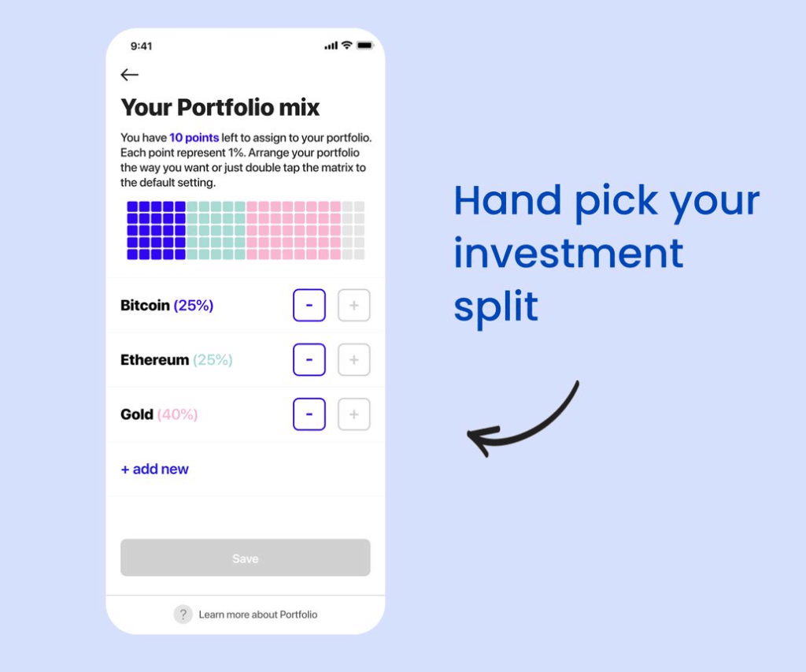

# Small Investment, Big future #
 
## How innovative tech start-ups are making complex investments easy and accessible ##
 
 
### **Bamboo** was  founded in 2017, by Blake Cassidy - CEO. Ben Ritchie - Director. Blake Hall - CMO and is based out of Perth Australia. ###
### **Bamboo's** mission is to make a cryptocurrency investment platform for the rest of us, this came about as there were no apps of this kind in the Australian fintech landscape that were Australian owned, most if not all were based in the U.S.A. ###
### **Bamboo** has held a Series A funding round announced on November 1 2021. It raised $4m Australian ###
 
 
 ### **Bamboo** brings together two ideas. One complicated, cryptocurrency,  and one a bit more simple, micro-investing *(ref 1)*. Cryptocurrency, sometimes called crypto-currency or crypto(which will be used from now), is any form of currency that exists digitally or virtually and uses cryptography to secure transactions. Cryptocurrencies don't have a central issuing or regulating authority, instead using a decentralized system to record transactions and issue new units.  Microinvesting works by transferring round-ups from everyday purchases into a diversified portfolio. An example of a round up is you purchase a meal for $13.20, **Bamboo** would round-up $0.80 and place it into your investment portfolio. ###
 
 
 ### **Bamboo** the investment app as stated in their mission before is for the "rest of us". So for people who don't have a large sum of money to invest it provides an opportunity to enter both the Crypto and precious metals markets **Bamboo** says it has grown to more than 11,000 active investors in the past nine months, who have invested over $9 million in Bitcoin, Ethereum and precious metals *(ref 2)*. ###
 
 
### **Bamboo** app is the Crypto version of micro investing platforms. The app utilises the power of cost averaging. This is investing small amounts of money frequently. This strategy is proven to be better than trying to “time the market”. **Bamboo** is the only app of its kind in Australia that enables Crypto micro investing. It also utilises the power of round-up technology to then invest in Crypto. ###
 

 
 

### **Bamboo** uses Google Analytics and Amazon Web Services, to gather information about the user to provide a more personalised service to the user.  Financial services software company Sila Inc. (Sila) and banking services provider Evolve Bank & Trust (Evolve), both FDIC members are the banking partners used for transactions *(ref 3)*.  The FDIC stands for Federal Deposit Insurance Corporation is an independent agency created by the U.S. Congress to maintain stability and public confidence in the nation's financial system *(ref 4)*. ###
 
 
### The domain **Bamboo** resides in investment management in particular micro-investment. Micro-investing platforms are apps that let users contribute small sums of money to a brokerage account. By connecting a debit card, a micro-investing platform can round up your purchases or make automatic transfers on your behalf. The major trends are platforms like Raiz, one of the first micro-investing platforms in Australia, is also the most well-known, having spawned a cult-like following from millennials. In just six months in 2020, more than 300,000 new investors started using it *(ref 5). **Bamboo** started a new trend in Australia as stated before as it is the first micro-investing platform that allows the user to invest in Crypto. There are no other micro-investing apps that allow you to invest in your choice of percentage of portfolio like **Bamboo**, some will allow you to select Crypto as part of a portfolio like Raiz for example but the only Crypto available is Bitcoin. ###
 
 
### **Bamboo** The platform launched in 2019, but really only started really growing its user base nine months ago, quickly growing more than 11,000 active investors in the past nine months, who have invested over $9 million in Bitcoin, Ethereum and precious metals *(ref 2)*. With this growth using Acquisition Metrics and Activation Metrics this shows substantial growth. *(ref 6)*. Since there are no direct competitors  I looked at Raiz's full year results for financial year 20-21 and their active customer growth was 87% for this period but over the last 5 years this is averaged at 45% which is similar for **Bamboo** ###

 
### Where **Bamboo** may improve its platform to add different crypto coins allowing users to diversify their portfolios more. This does bring about more risk but if this is the only way people are investing in crypto they may like to diversify their portfolio. This may require greater level of software development to add in other variables and more server investment as is more computing power to process more data. ###

## References ##
### 1 DR KATE RAYNES-GOLDIE. 3/5/2018. [Scitech] (https://particle.scitech.org.au/tech/cryptocurrency-for-the-rest-of-us/) ###
### 2 Derek Rose. 26/08/2021. [StockHead] (https://stockhead.com.au/cryptocurrency/crypto-microinvesting-platform-bamboo-reaches-11000-users-over-5-8m-aum/) ###
### 3 Bamboo Privacy policy. viewed 23/2/2022. [Bamboo] (https://www.getbamboo.io/legal/privacy-policy/)
### 4 Federal Deposit Insurance Corporation. viewed 23/3/2022. [FDIC] (https://www.fdic.gov/) ### 
### 5 Saving.com.au viewed 23/2/2022. [Savings Australia] (https://www.savings.com.au/savings-accounts/who-offers-micro-investing-apps-in-australia) ###
### 6 Amit Levi. yahoofinance. 13/6/2019. [yahoo finance] (https://finance.yahoo.com/news/fintech-analytics-top-7-metrics-182104952.html?guccounter=1&guce_referrer=aHR0cHM6Ly93d3cuZ29vZ2xlLmNvbS8&guce_referrer_sig=AQAAAD11O777FeAfFq677iflNaOFxCscX3pj6CFhRSaapU04bCbd_Jw2WsNHXATPlxvU2Lc-a5V5mirnq7X7hSjTFhIfRxHoJsjb2QMqz3DL32b1CYwLH7XgfwNXoBWYP1QYRNhnK8siSN6UPkZ9sS4dMcA_mLywBpjPJzdgsyrmUpNI) ###

